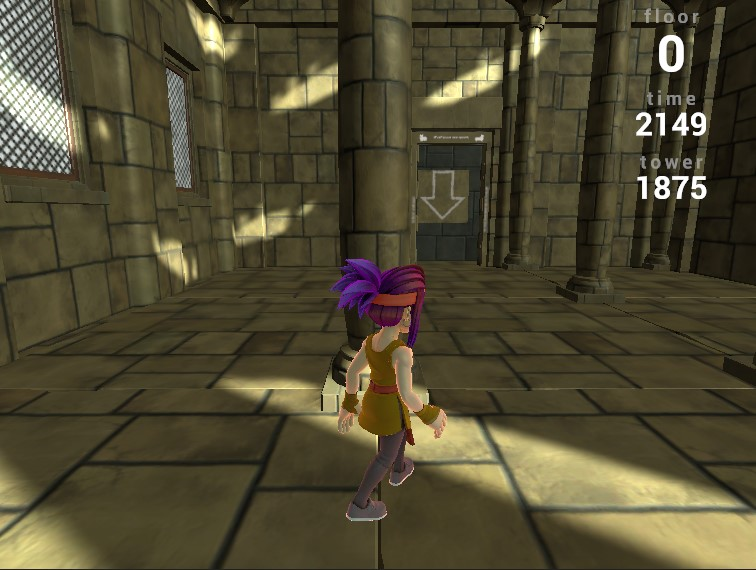

Source code: (https://github.com/andrewzho/Group-14-oc-rl/tree/main)

Reports:

- [Proposal](proposal.md)
- [Status](status.html)
- [Final](final.html)

TowerMasters: Reinforcement Learning in Obstacle Tower

Welcome to TowerMasters, a CS 175 project where we train a reinforcement learning (RL) agent to navigate the Obstacle Tower environment using Proximal Policy Optimization (PPO). We aim to teach the agent to climb procedurally generated floors by implementing a custom PPO with frame stacking and reward shaping while comparing it to a Stable-Baselines3 baseline.

Source Code Repository

Our project code is hosted on GitHub: https://github.com/andrewzho/Group-14-oc-rl/tree/main. Check out src/train.py for our custom PPO and src/train2.py for the Stable-Baselines3 version.

Project Snapshot

Here's a screenshot of our agent in action during training:

Resources

We've relied on these key resources:
- Obstacle Tower Environment: https://github.com/Unity-Technologies/obstacle-tower-env - The environment we're tackling.
- Stable-Baselines3 Documentation: https://stable-baselines3.readthedocs.io/ - For our baseline PPO implementation.
- PyTorch Documentation: https://pytorch.org/docs/stable/index.html - Core library for our custom PPO.

Stay tuned for our progress report in status.md!

Just getting started with Markdown?
See the [HTML <-> Markdown Quick Reference (Cheat Sheet)][quickref].

[quickref]: https://github.com/mundimark/quickrefs/blob/master/HTML.md
