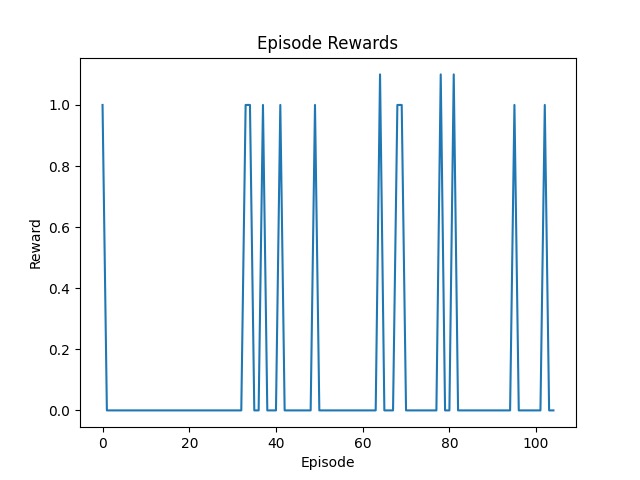
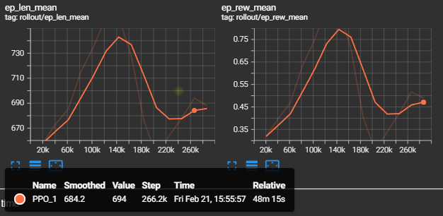

<iframe width="560" height="315" src="https://www.youtube.com/embed/tzBmypUJL6Q" frameborder="0" allowfullscreen></iframe>

# TowerTamers Project Status

## Project Summary

TowerTamers is a reinforcement learning (RL) project focused on training an agent to navigate the Obstacle Tower environment, a 3D procedurally generated tower with increasing difficulty. We implement a custom Proximal Policy Optimization (PPO) algorithm enhanced with frame stacking and reward shaping to improve exploration and movement, alongside a Stable-Baselines3 PPO baseline for comparison. Our goal is to enable the agent to climb floors effectively, adapting to the environment's challenges using both tailored and off-the-shelf RL techniques.

## Approach

Our implementation uses Proximal Policy Optimization (PPO), a policy gradient method that balances stability and sample efficiency. The algorithm consists of several key components:

### Core Algorithm
* Samples actions from a policy π(a|s)
* Optimizes a clipped surrogate loss: `-min(r_t * A_t, clip(r_t, 1-ε, 1+ε) * A_t)`
  * Where `r_t = π(a_t|s_t) / π_old(a_t|s_t)`
  * `A_t` is the Generalized Advantage Estimate (GAE)
  * `ε=0.1`
* Value function minimizes `MSE(V(s_t), R_t)`, where `R_t` is the discounted return
* Includes entropy bonus `-0.01 * H(π)` to encourage exploration [Schulman et al., 2017]

### Custom Implementation Details (src/train.py)
* Input: 4 stacked RGB frames (shape `[12, 84, 84]`)
* Output: 54 discrete actions via ActionFlattener for MultiDiscrete action space
  * Covers movement, rotation, jump, and interaction
* Reward shaping:
  * +0.01 for walking (move_idx != 0)
  * -0.005 for jumping (jump_idx == 1)

### Network Architecture
* Four convolutional layers reducing `[12, 84, 84]` to `[64, 5, 5]`
* 1024-unit FC layer
* Training parameters:
  * Steps: Up to 1M
  * Learning rate: 1e-4
  * Epochs: 10
  * Batch size: 128

### Stable-Baselines3 Version (src/train2.py)
* Uses "MlpPolicy"
* Flattens observations to `[21168]` (due to time constraints)
* Similar hyperparameter adjustments to custom implementation

## Evaluation

We evaluated both implementations with the following results:

### Custom PPO (src/train.py)
* Training duration: ~10k steps
* Results:
  * Episode rewards plateau at 1.0 or 0.0
  * Indicates sparse feedback
* Qualitative observations:
  * Frequent jumping behavior
  * Occasional walking
  * Limited progress

*Figure 1: Episode rewards for custom PPO over ~10k steps, plateauing at 1.0 or 0.0.*

*Figure 2: Screenshot of the custom PPO agent, often jumping without progress.*

### Stable-Baselines3 PPO (src/train2.py)
* Training duration: ~10k steps
* Results:
  * Rewards range between 0.0-1.0
  * Similar performance issues to custom implementation

*Figure 3: Episode rewards for Stable-Baselines3 PPO, showing similar low performance.*

## Remaining Goals and Challenges

### Planned Improvements
1. Reward Function Refinement
   * Add distance-based rewards for climbing
   * Explore additional reward shaping strategies

2. Implementation Updates
   * Switch to "CnnPolicy" in Stable-Baselines3
   * Extend training duration to 100k+ steps
   * Implement comprehensive success metrics

3. Evaluation Expansion
   * Quantify success rate (floors climbed)
   * Compare custom vs. Stable-Baselines3 performance

### Current Challenges

#### Technical Issues
* Frequent Unity crashes
  * Possible memory/CPU constraints
  * Potential solutions:
    * Reduce frame stack size
    * Debug Unity logs

#### Learning Performance
* Slow learning progress
  * Expected with sparse rewards
  * Potential solutions:
    * Hyperparameter tuning
    * Larger clip range
    * Extended training duration

#### Time Constraints
* Limited evaluation runs
* Restricted hyperparameter exploration
* Planning additional runs post-deadline

## Resources

* [Obstacle Tower Environment](https://github.com/Unity-Technologies/obstacle-tower-env) - Core environment
* [Stable-Baselines3 Documentation](https://stable-baselines3.readthedocs.io/) - Baseline PPO guidance
* [PyTorch Documentation](https://pytorch.org/docs/stable/index.html) - Neural network implementation
* [Schulman et al., 2017](https://arxiv.org/abs/1707.06347) - PPO algorithm details
